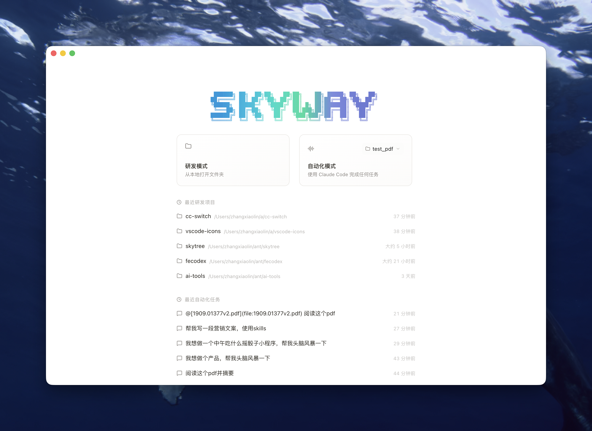
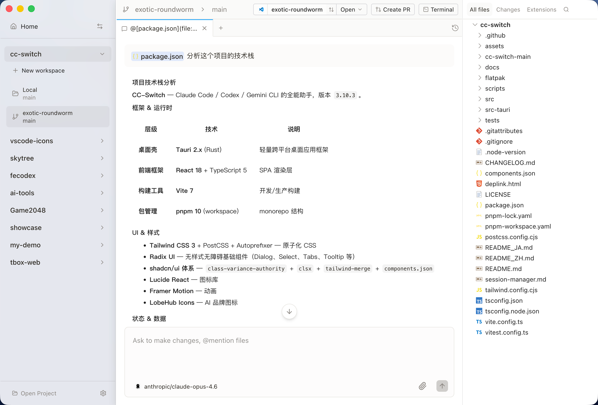
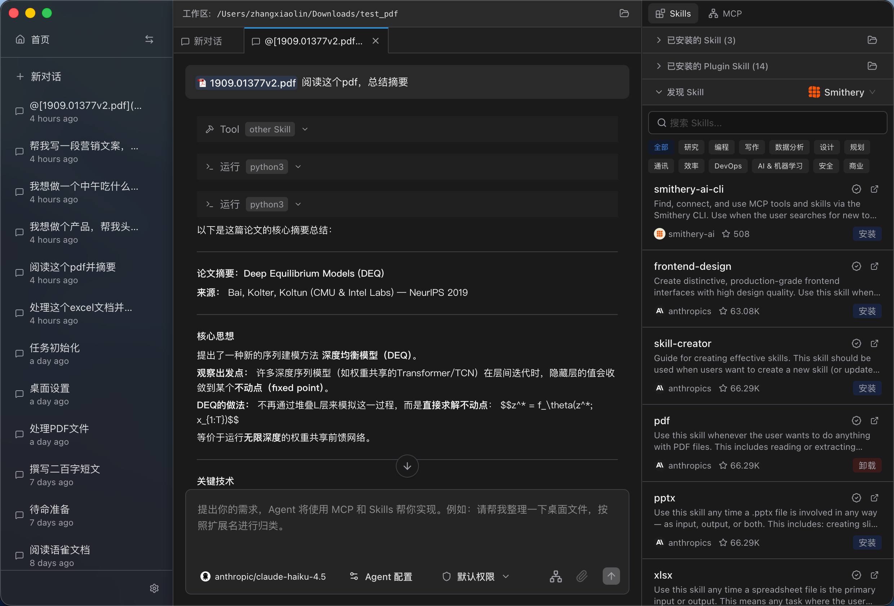

# Skyway

中文 | [English](./README.md)

**Skyway** 是一款强大的 AI 桌面应用，融合了智能研发辅助与通用自动化能力。

## 双模式，无限可能

### 🛠️ 研发模式

为开发者打造的全功能 AI 编程助手：

- 💬 **智能对话** - 通过自然语言交流，解决编程问题
- 🤖 **多模型支持** - 兼容 Claude、OpenAI 及自定义 AI 服务商
- 📁 **项目工作区** - 使用独立工作区组织多个项目
- 🌳 **文件树** - 可视化文件浏览器，支持语法高亮预览
- 🔀 **Git Worktree 隔离** - 每个 Agent 在独立的 worktree 中工作，改动不影响主代码库，放心让 AI 大胆尝试
- 💻 **集成终端** - 应用内支持多终端会话
- 🖥️ **IDE 集成** - 与 VS Code 等 IDE 无缝连接

### ⚡ 自动化模式

无需项目上下文的轻量级 AI 交互模式：

- 🚀 **即开即用** - 无需打开项目，即可开始对话
- 💡 **通用场景** - 提问、头脑风暴、内容创作等多种用途
- 🎯 **任务自动化** - 借助 AI 自动化处理重复性任务
- 📋 **零配置** - 适合快速提问和日常任务处理

|               研发模式               |               自动化模式                |
| :----------------------------------: | :-------------------------------------: |
|  |  |

## 通用功能

- 🔧 **自定义服务商** - 配置 OpenAI 兼容的自定义 API 端点
- 🧩 **MCP 支持** - 模型上下文协议，扩展 AI 能力
- ⚡ **技能系统** - 安装和管理 AI 技能，执行专业任务
- 🔌 **插件市场** - 发现和安装社区扩展
- 🌙 **深色模式** - 完整的暗黑主题支持
- 🌐 **国际化** - 支持中文和英文

## 安装

### macOS

从 [Releases](https://github.com/weavefox/skyway/releases) 下载最新的 `.dmg` 文件，拖拽至应用程序文件夹。

**系统要求：** macOS 12.0 或更高版本

## 快速开始

1. **选择模式**
   - **研发模式** - 打开项目文件夹，获得完整的编程辅助
   - **自动化模式** - 无需项目，即可开始 AI 对话

2. **配置服务商** - 设置首选 AI 服务商（Claude、OpenAI 或自定义）

3. **开始使用** - 编写代码、提问或使用 AI 自动化任务

## 文档

📚 详细的使用指南和教程，请访问 [语雀知识库](https://www.yuque.com/weavefox/skyway)。

---

<!-- GITCONTRIBUTOR_START -->

## 贡献者

|[ <b>WynterDing</b>](https://github.com/WynterDing) |[ <b>hustcc</b>](https://github.com/hustcc) |[ <b>harryecho996</b>](https://github.com/harryecho996) |[ <b>myzxlin</b>](https://github.com/myzxlin) |[ <b>yangkeni</b>](https://github.com/yangkeni) |[ <b>z0gSh1u</b>](https://github.com/z0gSh1u) |[ <b>onlylovermb</b>](https://github.com/onlylovermb) |[ <b>chujianyun</b>](https://github.com/chujianyun) |
| :---: | :---: | :---: | :---: | :---: | :---: | :---: | :---: |
[ <b>xudafeng</b>](https://github.com/xudafeng) 

[git-contributor 说明](https://github.com/xudafeng/git-contributor)，自动生成时间：`Fri Mar 20 2026 11:27:15 GMT+0000`。

<!-- GITCONTRIBUTOR_END -->

---

## 许可证

**AGPL-3.0** - GNU Affero 通用公共许可证 v3.0

Skyway 可免费使用。如果您修改并分发，或将其作为服务运行，您的代码也必须在 AGPL-3.0 下开源。

如需闭源使用，可联系我们获取商业许可。
